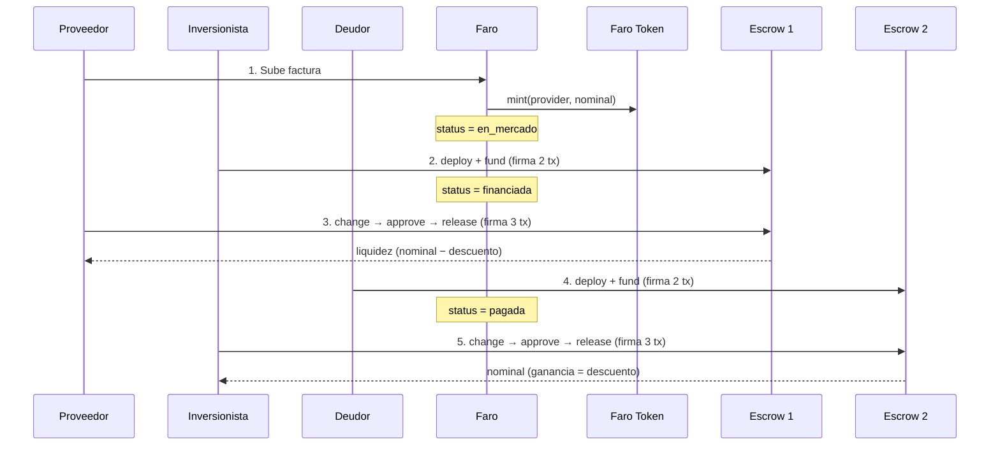
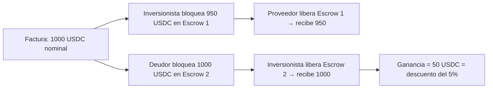

# Faro

> El faro que alumbra y guía tu negocio. Liquidez inmediata para PyMEs mediante factoraje descentralizado sobre Stellar.

Faro es una plataforma de **factoraje de facturas** que conecta a **proveedores** (que emiten facturas), **negocios** (deudores que las pagan) e **inversionistas** (que adelantan el pago con descuento). Toda la custodia del dinero ocurre **on-chain en Stellar**, sin que la plataforma toque los fondos: un contrato de tokenización propio registra cada factura como activo, y dos escrows independientes de [Trustless Work](https://www.trustlesswork.com/) custodian los dos movimientos de USDC (inversionista→proveedor y deudor→inversionista).

---

## Índice

- [¿Qué es Faro?](#qué-es-faro)
- [Usuarios](#usuarios)
- [Arquitectura on-chain](#arquitectura-on-chain)
  - [Componentes](#componentes)
  - [Flujo de los dos escrows](#flujo-de-los-dos-escrows)
- [Estados de una factura](#estados-de-una-factura)
- [Descuentos y ganancia](#descuentos-y-ganancia)
- [Tecnología](#tecnología)
- [Estructura del proyecto](#estructura-del-proyecto)
- [Setup local](#setup-local)
- [Variables de entorno](#variables-de-entorno)
- [Obtener USDC y trustline en testnet](#obtener-usdc-y-trustline-en-testnet)
- [Estado de producción](#estado-de-producción)
- [Documentación adicional](#documentación-adicional)

---

## ¿Qué es Faro?

Las PyMEs tienen un problema común: **facturas por cobrar** que vencen en 30, 60 o 90 días generan falta de liquidez. En lugar de esperar al vencimiento, el **proveedor** sube la factura a Faro y la liga al **negocio** que le debe. Un **inversionista** paga la factura con descuento (8, 9 o 10%) y el proveedor recibe liquidez al instante. En la fecha de vencimiento, el negocio paga el 100% del nominal a través de Faro; ese monto llega al inversionista. La diferencia (el descuento) es la ganancia del inversionista.

**Lo que aporta cada rol:**

- **Proveedor:** liquidez anticipada sin esperar el vencimiento.
- **Negocio:** mantiene su plazo de pago, paga una sola vez el 100% en la plataforma.
- **Inversionista:** renta predecible (descuento acordado) con respaldo on-chain — los fondos viven en un escrow que solo libera contra la liberación del proveedor / la liberación del propio inversionista.

---

## Usuarios

| Rol | Descripción | Función principal |
|-----|-------------|--------------------|
| **Proveedor** | Quien emite la factura (acreedor). | Sube facturas y las **liga al negocio** deudor. Recibe liquidez cuando libera Escrow 1. |
| **Negocio (deudor)** | Empresa que debe la factura. | Al vencimiento, paga el **valor nominal** bloqueándolo en Escrow 2. |
| **Inversionista** | Quien invierte comprando facturas. | Financia facturas con descuento (Escrow 1) y al vencimiento reclama el nominal (Escrow 2). |

Los tres roles necesitan: **wallet Stellar (Freighter), red Testnet, trustline USDC, saldo USDC**. La app tiene un wizard de onboarding que los configura paso a paso (incluido añadir la trustline con un solo click).

---

## Arquitectura on-chain

Faro tiene **3 tipos** de transacción on-chain. Todas en Stellar Testnet.

### Componentes

```
┌──────────────────────────────────────────────────────────────────┐
│  CONTRATO FARO INVOICE TOKEN  (Soroban, propio)                  │
│  • mint(provider, amount) → registra la factura como token       │
│  • Firma: cuenta admin (server-side, FARO_TOKEN_ADMIN_SECRET_KEY)│
└──────────────────────────────────────────────────────────────────┘

┌──────────────────────────────────────────────────────────────────┐
│  ESCROW 1 — Inversión   (Trustless Work, single-release)         │
│  • signer/fondea:   inversionista                                │
│  • receiver:        proveedor                                    │
│  • releaseSigner:   proveedor                                    │
│  • monto:           nominal × (1 − descuento/100)                │
└──────────────────────────────────────────────────────────────────┘

┌──────────────────────────────────────────────────────────────────┐
│  ESCROW 2 — Nominal     (Trustless Work, single-release)         │
│  • signer/fondea:   deudor                                       │
│  • receiver:        inversionista                                │
│  • releaseSigner:   inversionista                                │
│  • monto:           nominal (100%)                               │
└──────────────────────────────────────────────────────────────────┘
```

- **Tokenización ≠ escrow.** El `mint` solo registra la factura. Los escrows custodian dinero (USDC).
- **Trustless Work devuelve XDR sin firmar.** El front lo firma con Freighter y lo envía al RPC. La API de Faro nunca firma transacciones de escrow.
- **El backend solo tiene un secreto:** la clave admin del contrato de tokenización. Todo lo demás lo controla el usuario con su wallet.

Detalle archivo por archivo, roles exactos, contratos y código → **[docs/ARCHITECTURE.md](docs/ARCHITECTURE.md)**.

### Flujo de los dos escrows





---

## Estados de una factura

| Estado | Cuándo se entra | Trigger on-chain |
|--------|-----------------|------------------|
| `en_mercado` | Al subir la factura | `mint` en contrato Faro Token |
| `financiada` | Al invertir | Escrow 1 creado y fondeado |
| `pagada` | Al pagar el deudor | Escrow 2 creado y fondeado |
| `vencida` | Vencimiento sin pago | (no implementado todavía) |

Hay dos hitos adicionales **dentro** de los estados, controlados por timestamps:

- `providerClaimedAt` — el proveedor liberó Escrow 1 y recibió su liquidez.
- `investorClaimedAt` — el inversionista liberó Escrow 2 y recibió su nominal.

Definición en `lib/product/invoice-flow.ts` y `lib/product/invoice-types.ts`.

---

## Descuentos y ganancia

La plataforma ofrece facturas con **8, 9 o 10% de descuento**. El negocio siempre paga el 100%; la diferencia es la ganancia del inversionista.

**Ejemplo (10% de descuento):**

| Concepto | Monto |
|----------|--------|
| Valor nominal | $100,000 |
| Descuento (10%) | $10,000 |
| Inversionista bloquea en Escrow 1 (y proveedor recibe) | $90,000 |
| Deudor bloquea en Escrow 2 | $100,000 |
| Inversionista recibe al liberar Escrow 2 | $100,000 |
| **Ganancia bruta del inversionista** | **$10,000** |

Helpers en `lib/product/roles.ts`:
- `amountAfterDiscount(nominal, discountPercent)` → monto del Escrow 1.
- `investorGrossProfit(nominal, discountPercent)` → ganancia bruta.

---

## Tecnología

- **Frontend:** Next.js 16 (App Router, Turbopack), React 19, TypeScript, Tailwind CSS, Radix UI, shadcn/ui.
- **Auth:** [Clerk](https://clerk.com/) (email/Google/etc.) — el login social no toca claves Stellar.
- **Wallet:** [`@creit.tech/stellar-wallets-kit`](https://github.com/Creit-Tech/Stellar-Wallets-Kit) (Freighter, xBull, Albedo, Hana).
- **Tokenización:** contrato Soroban propio en `contracts/faro_invoice_token/` (Rust + OpenZeppelin Stellar).
- **Escrows:** [Trustless Work SDK](https://github.com/Trustless-Work/Trustless-Work-Smart-Escrow) (`@trustless-work/escrow`), single-release sobre USDC.
- **Red:** Stellar Testnet (Soroban RPC + Horizon).

---

## Estructura del proyecto

```
├── app/                              # Next.js App Router
│   ├── page.tsx                      # Landing pública
│   ├── api/invoices/                 # Rutas API (persisten estado, no firman)
│   │   ├── route.ts                  # POST: crea + mintea · GET: lista
│   │   └── [id]/
│   │       ├── route.ts              # GET detalle
│   │       ├── invest/               # POST: marca financiada
│   │       ├── pay/                  # POST: marca pagada
│   │       ├── claim-by-provider/    # POST: marca providerClaimedAt
│   │       └── claim-by-investor/    # POST: marca investorClaimedAt
│   └── app/                          # App autenticada (Clerk)
│       ├── page.tsx                  # Dashboard
│       ├── tokenize/                 # Proveedor sube factura
│       ├── market/[id]/              # Inversionista invierte (crea Escrow 1)
│       ├── pay/[id]/                 # Deudor paga (crea Escrow 2)
│       ├── claim-provider/[id]/      # Proveedor libera Escrow 1
│       └── claim-investor/[id]/      # Inversionista libera Escrow 2
├── components/
│   ├── app/                          # Shell del dashboard
│   │   ├── app-shell.tsx
│   │   ├── app-header.tsx
│   │   ├── app-sidebar.tsx
│   │   └── wallet-status-bar.tsx     # Barra persistente (red, USDC, trustline)
│   ├── wallet/
│   │   ├── connect-wallet-button.tsx
│   │   ├── wallet-onboarding-dialog.tsx  # Wizard de 4 pasos (incluye trustline en 1 click)
│   │   └── escrow-stepper.tsx        # Stepper compartido para los 4 flujos on-chain
│   ├── invoice/
│   │   └── invoice-timeline.tsx      # Timeline visual del ciclo de vida (5 hitos)
│   ├── landing/                      # Hero, features, how-it-works, footer
│   └── ui/                           # shadcn/ui
├── lib/
│   ├── product/                      # Roles, estados, descuentos
│   ├── api/
│   │   └── invoices-store.ts         # Store (JSON; reemplazable por DB)
│   ├── soroban/
│   │   └── mint-invoice-token.ts     # Mint server-side con admin secret key
│   ├── trustless-work/
│   │   └── constants.ts              # USDC trustline, decimales, fee
│   ├── wallet/
│   │   ├── stellar-wallet-kit-provider.tsx  # Context de la wallet
│   │   ├── use-wallet-status.ts             # Hook con red/USDC/balances en vivo
│   │   ├── wallet-onboarding-context.tsx    # Provider del wizard
│   │   ├── add-usdc-trustline.ts            # Firma + envía ChangeTrust
│   │   └── get-account-balances.ts          # Lee balances via Horizon
│   └── stellar-explorer-urls.ts      # Helpers de Stellar Expert
├── contracts/
│   ├── faro_invoice_token/           # Contrato Soroban (Rust)
│   │   ├── src/lib.rs
│   │   └── deploy-testnet.sh
│   └── README.md                     # Build y deploy
├── docs/
│   ├── ARCHITECTURE.md               # Detalle técnico completo ⭐
│   ├── PLAN-DOS-ESCROWS.md           # Plan original (ya implementado)
│   ├── PRODUCT-USUARIOS-Y-FLUJO.md
│   ├── SEP-AND-TRUSTLESS-WORK.md
│   ├── TOKENIZATION-OPENZEPPELIN.md
│   └── MVP-ROADMAP.md
├── data/invoices.json                # Store de facturas (MVP; no funciona en Vercel)
├── .env.example
└── README.md
```

---

## Setup local

**Requisitos:** Node.js 18+, pnpm.

```bash
pnpm install
cp .env.example .env
# Edita .env con tus valores (ver siguiente sección)
pnpm dev
```

Abre [http://localhost:3000](http://localhost:3000). La landing está en `/`; la app autenticada en `/app`.

Para usar la app necesitas:
1. **Login con Clerk** (en dev funciona en keyless mode sin keys).
2. **Wallet Stellar (Freighter)** en Testnet, con USDC trustline y algo de XLM. El wizard de onboarding te guía — incluye un botón "Añadir trustline" que firma y envía la `ChangeTrust` por ti.

---

## Variables de entorno

Resumen. El detalle completo está en [docs/ARCHITECTURE.md](docs/ARCHITECTURE.md#variables-de-entorno).

### Autenticación (Clerk)

```bash
NEXT_PUBLIC_CLERK_PUBLISHABLE_KEY=
CLERK_SECRET_KEY=
```

> Opcional en dev (Clerk usa keyless mode). Obligatorio en producción.

### Tokenización (admin del contrato Soroban)

```bash
SOROBAN_RPC_URL=https://soroban-testnet.stellar.org
SOROBAN_NETWORK_PASSPHRASE="Test SDF Network ; September 2015"
FARO_INVOICE_TOKEN_CONTRACT_ID=CCSGO7GCC5GYNOHQJOKVVOCMNCWHEBEQDV7NUMSZ4NBRCPYGSEGDMWPH
FARO_TOKEN_ADMIN_SECRET_KEY=S...    # ¡secreta! solo en servidor
NEXT_PUBLIC_SOROBAN_RPC_URL=https://soroban-testnet.stellar.org
NEXT_PUBLIC_STELLAR_NETWORK=testnet
```

> La cuenta admin (`FARO_TOKEN_ADMIN_SECRET_KEY`) debe tener XLM en testnet para pagar fees del `mint`.

### Escrows (Trustless Work SDK)

```bash
NEXT_PUBLIC_API_KEY=                  # publishable key del SDK
NEXT_PUBLIC_TRUSTLESS_WORK_API_URL=https://dev.api.trustlesswork.com
# Opcional: cuenta plataforma (necesita USDC). Si no se define, fallback al investor/debtor.
# NEXT_PUBLIC_TRUSTLESS_WORK_PLATFORM_ADDRESS=
```

---

## Obtener USDC y trustline en testnet

Para invertir, pagar o reclamar **necesitas USDC en tu wallet**. El wizard de onboarding en la app hace este flujo automáticamente; si quieres hacerlo a mano:

1. **XLM testnet** — [Friendbot](https://friendbot.stellar.org/) (gratis).
2. **Trustline USDC** — en la app pulsa "Configurar wallet" en la barra de estado y elige "Añadir trustline USDC" (un click). Si lo haces manual en Freighter: Manage Assets → Add Asset → código `USDC`, emisor `GBBD47IF6LWK7P7MDEVSCWR7DPUWV3NY3DTQEVFL4NAT4AQH3ZLLFLA5`.
3. **USDC testnet** — [Circle Testnet Faucet](https://faucet.circle.com/) (Stellar Testnet, hasta 20 USDC).

Más detalle en [docs/SEP-AND-TRUSTLESS-WORK.md](docs/SEP-AND-TRUSTLESS-WORK.md#obtener-usdc-testnet--swap-cli).

---

## Estado de producción

**Funciona en local end-to-end** (todos los flujos on-chain de los dos escrows pasan).

**Bloqueadores conocidos para Vercel:**

1. 🚨 **Store en archivo JSON** (`lib/api/invoices-store.ts` escribe a `data/invoices.json`). En Vercel el filesystem es de solo lectura, así que crear facturas fallará con 503 (`EROFS`). **Pendiente: migrar a Supabase / Postgres**. El store está aislado tras una interfaz de 6 funciones, así que la migración es local a ese archivo.
2. **Wallets del deudor.** Para que Escrow 2 funcione, el deudor también necesita wallet + trustline USDC + saldo. Sin onboarding del deudor, el flujo queda en `financiada` sin avanzar.
3. **Validación de facturas es manual.** El estado `pendiente_validacion` existe en el enum pero hoy las facturas pasan directo a `en_mercado`.

Limitaciones detalladas → [docs/ARCHITECTURE.md#limitaciones-conocidas](docs/ARCHITECTURE.md#limitaciones-conocidas).

---

## Documentación adicional

- **[docs/ARCHITECTURE.md](docs/ARCHITECTURE.md)** ⭐ — Arquitectura técnica completa: componentes on-chain, lifecycle de los escrows, modelo de datos, rutas API, decisiones y trade-offs, limitaciones.
- **[docs/PRODUCT-USUARIOS-Y-FLUJO.md](docs/PRODUCT-USUARIOS-Y-FLUJO.md)** — Usuarios y flujo del producto.
- **[docs/PLAN-DOS-ESCROWS.md](docs/PLAN-DOS-ESCROWS.md)** — Plan original del modelo de dos escrows (implementado en mayo 2026).
- **[docs/SEP-AND-TRUSTLESS-WORK.md](docs/SEP-AND-TRUSTLESS-WORK.md)** — Integración Stellar y Trustless Work.
- **[docs/TOKENIZATION-OPENZEPPELIN.md](docs/TOKENIZATION-OPENZEPPELIN.md)** — Contrato Soroban de tokenización (Rust + OpenZeppelin Stellar).
- **[docs/MVP-ROADMAP.md](docs/MVP-ROADMAP.md)** — Roadmap del MVP.
- **[contracts/README.md](contracts/README.md)** — Build y deploy del contrato Soroban a testnet.

---

*Faro — Liquidez y guía para tu negocio.*
