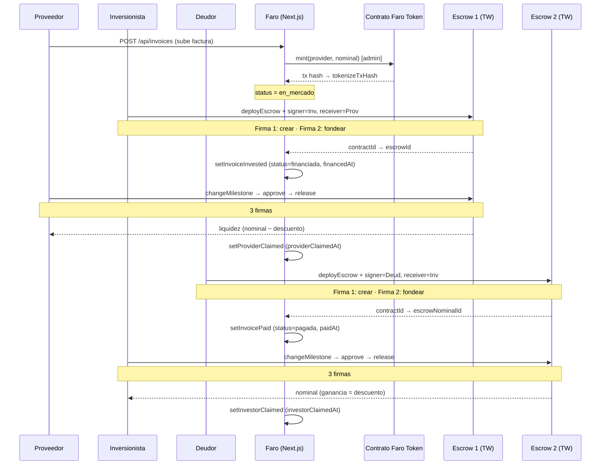

# Arquitectura técnica de Faro

Documento de referencia para entender, debuguear y extender la app. Si solo quieres una vista general del producto, lee el [README](../README.md). Aquí entramos en detalle: qué archivo hace qué, cómo viven los dos escrows, qué pasa cuando algo se rompe.

---

## Índice

- [Visión de capas](#visión-de-capas)
- [Componentes on-chain](#componentes-on-chain)
- [Ciclo de vida de una factura](#ciclo-de-vida-de-una-factura)
- [Modelo de datos](#modelo-de-datos)
- [Rutas API](#rutas-api)
- [Pantallas del front](#pantallas-del-front)
- [Wallet, red y trustline (UX)](#wallet-red-y-trustline-ux)
- [Variables de entorno](#variables-de-entorno)
- [Decisiones y trade-offs](#decisiones-y-trade-offs)
- [Limitaciones conocidas](#limitaciones-conocidas)

---

## Visión de capas

```
┌─────────────────────────────────────────────────────────────────────┐
│ Front Next.js (App Router, client + server components)              │
│  • Páginas /app/* protegidas con Clerk                              │
│  • Wallet: @creit.tech/stellar-wallets-kit (Freighter + otras)      │
│  • Escrows: @trustless-work/escrow (firma con wallet, envío al RPC) │
└──────────────┬──────────────────────────────┬───────────────────────┘
               │                              │
       ┌───────▼────────┐           ┌─────────▼──────────┐
       │ Rutas API      │           │ Stellar Testnet    │
       │ (Next.js Edge) │           │ + Soroban RPC      │
       │  • Persisten   │           │  • Contrato Faro   │
       │    estado de   │           │    Invoice Token   │
       │    facturas    │           │  • Contratos       │
       │  • Mintean     │           │    Escrow (TW)     │
       │    tokens      │           │  • USDC trustline  │
       └───────┬────────┘           └────────────────────┘
               │
       ┌───────▼────────────────┐
       │ Store de facturas      │
       │ data/invoices.json     │  ← MVP. En producción: Supabase.
       └────────────────────────┘
```

Tres mensajes clave:

- **La fuente de verdad del dinero es Stellar**, no la base de datos. La DB solo guarda metadatos (nombres, fechas, qué tx hash corresponde a qué factura).
- **La firma de las transacciones on-chain ocurre en el front**, con la wallet del usuario. Trustless Work devuelve XDR sin firmar; el front lo firma y lo envía al RPC.
- **El backend solo tiene un secreto**: la clave admin del contrato de tokenización (`FARO_TOKEN_ADMIN_SECRET_KEY`) para mintear. Todo lo demás lo controla el usuario con su wallet.

---

## Componentes on-chain

Faro usa **tres tipos** de transacción on-chain:

### 1. Mint del token de factura (`mint`)

- **Contrato:** Faro Invoice Token, propio (`contracts/faro_invoice_token/`).
- **Red:** Stellar Testnet (Soroban).
- **ID por defecto:** `CCSGO7GCC5GYNOHQJOKVVOCMNCWHEBEQDV7NUMSZ4NBRCPYGSEGDMWPH`.
- **Quién firma:** el backend con la cuenta admin (`FARO_TOKEN_ADMIN_SECRET_KEY`).
- **Cuándo:** al crear una factura vía `POST /api/invoices`.
- **Código:** `lib/soroban/mint-invoice-token.ts`.

Esta transacción es la prueba on-chain de que la factura existe en Faro. Se mintean tokens al proveedor por el monto nominal de la factura (en unidades mínimas con 6 decimales).

### 2. Escrow 1 — Inversión (`investor → provider`)

- **Contratos:** los del [SDK de Trustless Work](https://github.com/Trustless-Work/Trustless-Work-Smart-Escrow) (single-release). Se despliega uno nuevo por cada factura cuando hay inversión.
- **Quién firma:** el **inversionista** con su wallet.
- **Cuándo:** cuando un inversionista hace click en "Invertir" en `/app/market/[id]`.
- **Roles** (configurados en el payload `InitializeSingleReleaseEscrowPayload`):
  - `signer = address` (inversionista — quien crea y fondea)
  - `receiver = invoice.providerAddress` (proveedor — quien recibe los fondos al liberar)
  - `releaseSigner = invoice.providerAddress` (proveedor — único autorizado a liberar)
  - `approver / serviceProvider = invoice.providerAddress`
  - `platformAddress / disputeResolver = NEXT_PUBLIC_TRUSTLESS_WORK_PLATFORM_ADDRESS` o el inversionista como fallback
- **Monto fondeado:** `nominal × (1 − descuento/100)` (monto descontado, ej. 950 USDC sobre 1000 al 5%).
- **Liberación:** la dispara el proveedor en `/app/claim-provider/[id]` con la secuencia `changeMilestoneStatus → approveMilestone → releaseFunds`.
- **Persistencia:** el `contractId` se guarda en `Invoice.escrowId` y la fecha en `financedAt`. La fecha de liberación queda en `providerClaimedAt`.

### 3. Escrow 2 — Nominal (`debtor → investor`)

- **Contratos:** mismo SDK, mismo patrón single-release.
- **Quién firma:** el **deudor** con su wallet.
- **Cuándo:** cuando el deudor hace click en "Pagar" en `/app/pay/[id]`.
- **Roles:**
  - `signer = address` (deudor — quien crea y fondea)
  - `receiver = invoice.investorAddress` (inversionista — quien recibe al liberar)
  - `releaseSigner = invoice.investorAddress`
  - `approver / serviceProvider = invoice.investorAddress`
  - `platformAddress / disputeResolver = NEXT_PUBLIC_TRUSTLESS_WORK_PLATFORM_ADDRESS` o el deudor como fallback
- **Monto fondeado:** `nominal` completo (los 1000 USDC del ejemplo).
- **Liberación:** la dispara el inversionista en `/app/claim-investor/[id]` con la misma secuencia de 3 pasos.
- **Persistencia:** `contractId` en `Invoice.escrowNominalId`, fecha en `paidAt`, fecha de liberación en `investorClaimedAt`.

---

## Ciclo de vida de una factura



Total de firmas por factura (cuando todo se mueve on-chain): **10** (1 admin del mint + 2 al invertir + 3 al cobrar proveedor + 2 al pagar + 3 al reclamar inversionista). El admin del mint la hace el backend; las otras 9 son del usuario en distintos momentos.

---

## Modelo de datos

**`Invoice`** (en `lib/product/invoice-types.ts`):

| Campo | Tipo | Uso |
|---|---|---|
| `id` | `string` | "FAC-001", "FAC-002"… (autoincremental) |
| `providerAddress` | `string` | Wallet G… del proveedor |
| `emitterName`, `debtorName` | `string` | Razones sociales |
| `debtorAddress` | `string \| null` | Wallet G… del deudor. **Sin esto no se puede crear Escrow 1**. |
| `amount`, `currency`, `dueDate`, `discountRatePercent` | | Datos del título |
| `status` | `InvoiceStatus` | `en_mercado` / `financiada` / `pagada` / `vencida` |
| `createdAt` | ISO | Fecha de tokenización |
| `investorAddress` | `string \| null` | Wallet del inversionista que financió |
| `escrowId` | `string \| null` | Contract ID del **Escrow 1** |
| `escrowNominalId` | `string \| null` | Contract ID del **Escrow 2** |
| `financedAt` | ISO | Cuando se creó el Escrow 1 |
| `providerClaimedAt` | ISO | Cuando el proveedor liberó Escrow 1 |
| `paidAt` | ISO | Cuando se creó el Escrow 2 |
| `investorClaimedAt` | ISO | Cuando el inversionista liberó Escrow 2 |
| `tokenizeTxHash` | `string \| null` | Hash de la tx del `mint` |

**Store:** `lib/api/invoices-store.ts` lee/escribe `data/invoices.json`. Funciones:

- `createInvoice`, `setInvoiceTokenizeTxHash` — al crear y mintear.
- `setInvoiceInvested(id, investorAddress, escrowId)` — al invertir; transiciona `en_mercado → financiada`.
- `setProviderClaimed(id)` — al cobrar el proveedor.
- `setInvoicePaid(id, escrowNominalId)` — al pagar el deudor; transiciona `financiada → pagada`.
- `setInvestorClaimed(id)` — al reclamar el inversionista.
- `listInvoices({status?, providerAddress?, investorAddress?, debtorAddress?})` — usado por el dashboard.

> En producción este store se reemplaza por Supabase/Postgres sin tocar el resto del código. El contrato son las funciones, no el archivo.

---

## Rutas API

Todas en `app/api/invoices/`. Solo persisten estado; **ninguna firma transacciones de escrow**.

| Método | Ruta | Qué hace |
|---|---|---|
| `GET` | `/api/invoices` | Lista facturas; soporta filtros `status`, `provider`, `investor`, `debtor`. |
| `POST` | `/api/invoices` | Crea factura **+ mintea** (vía `mintInvoiceToken`). Devuelve 502 si el mint falla. |
| `GET` | `/api/invoices/[id]` | Detalle de una factura. |
| `POST` | `/api/invoices/[id]/invest` | Marca como `financiada` con `investorAddress` y `escrowId`. |
| `POST` | `/api/invoices/[id]/claim-by-provider` | Registra `providerClaimedAt`. |
| `POST` | `/api/invoices/[id]/pay` | Marca como `pagada` con `escrowNominalId` y `paidAt`. |
| `POST` | `/api/invoices/[id]/claim-by-investor` | Registra `investorClaimedAt`. |

> Las cuatro rutas de transición de estado se llaman **después** de que el front ya completó la operación on-chain. Si la operación on-chain falla, la API no se llama y el estado en DB no avanza — esto evita estados inconsistentes.

---

## Pantallas del front

| Ruta | Quién | Función |
|---|---|---|
| `/app` | cualquier rol | Dashboard: resumen, acciones pendientes, actividad reciente |
| `/app/tokenize` | Proveedor | Subir factura → mint |
| `/app/market` | Inversionista | Catálogo de facturas en `en_mercado` |
| `/app/market/[id]` | cualquier rol | Detalle (timeline + invertir si está en mercado) |
| `/app/pay/[id]` | Deudor | Crear y fondear Escrow 2 |
| `/app/claim-provider/[id]` | Proveedor | Liberar Escrow 1 |
| `/app/claim-investor/[id]` | Inversionista | Liberar Escrow 2 |
| `/app/settings` | cualquier rol | Ajustes de cuenta |

Cada pantalla de acción muestra el `InvoiceTimeline` arriba (estado on-chain con enlaces a Stellar Expert) y un `EscrowStepper` durante la ejecución (qué firma va, dónde está).

---

## Wallet, red y trustline (UX)

Tres componentes hacen que la wallet sea fácil de usar:

### `WalletStatusBar` (`components/app/wallet-status-bar.tsx`)
Barra persistente arriba de `/app` que muestra en vivo: dirección, red real vs esperada, trustline USDC, balances XLM y USDC. Si detecta problema (red incorrecta, sin trustline, cuenta sin fondear), pinta ámbar y enlaza al wizard.

### `WalletOnboardingDialog` (`components/wallet/wallet-onboarding-dialog.tsx`)
Wizard de 4 pasos que detecta automáticamente qué falta:
1. Conectar Freighter (instalar si hace falta)
2. Cambiar a Testnet
3. Fondear con XLM (link a Friendbot)
4. **Añadir trustline USDC con un click** — firma la `ChangeTrust` y la envía sin que el usuario salga de la app (`lib/wallet/add-usdc-trustline.ts`).

Se autoabre la primera vez que un usuario logueado en Clerk entra a `/app` sin wallet conectada. Botón "No mostrar de nuevo" lo persiste en `localStorage`.

### `EscrowStepper` (`components/wallet/escrow-stepper.tsx`)
Stepper visual de los pasos de cada operación on-chain (preparando XDR / firmando en Freighter / enviando a la red). Pensado para reducir la sensación de cuelgue mientras una firma queda en espera. Hook `useEscrowStepper` con `start/complete/fail`.

### `InvoiceTimeline` (`components/invoice/invoice-timeline.tsx`)
Vista del ciclo de vida completo de una factura (5 hitos: tokenizada → invertida → cobrada por proveedor → pagada → reclamada). Cada hito con fecha real, contrapartes y enlace a Stellar Expert (tx del mint, contratos de los escrows).

### Hook compartido `useWalletStatus` (`lib/wallet/use-wallet-status.ts`)
Centraliza la detección: red, balances, trustline, cuenta fondeada. La `WalletStatusBar` y el wizard lo consumen.

---

## Variables de entorno

Tres grupos:

### Autenticación (Clerk)

| Variable | Lado | Uso |
|---|---|---|
| `NEXT_PUBLIC_CLERK_PUBLISHABLE_KEY` | cliente | Login social |
| `CLERK_SECRET_KEY` | server | Validación de sesión |

> Sin keys, Clerk usa **keyless mode** en desarrollo. Para producción hay que tener cuenta en Clerk y rellenar ambas.

### Tokenización on-chain (Soroban admin)

| Variable | Lado | Uso |
|---|---|---|
| `SOROBAN_RPC_URL` | server | RPC para enviar el `mint` |
| `SOROBAN_NETWORK_PASSPHRASE` | server | `"Test SDF Network ; September 2015"` |
| `FARO_INVOICE_TOKEN_CONTRACT_ID` | server | ID del contrato desplegado |
| `FARO_TOKEN_ADMIN_SECRET_KEY` | **server, secreto** | Clave admin que firma el `mint` |
| `NEXT_PUBLIC_SOROBAN_RPC_URL` | cliente | Misma RPC (para enlaces) |
| `NEXT_PUBLIC_STELLAR_NETWORK` | cliente | `testnet` (no cambiar sin redesplegar) |

### Escrows (Trustless Work SDK)

| Variable | Lado | Uso |
|---|---|---|
| `NEXT_PUBLIC_API_KEY` | cliente | API key publishable del SDK de TW |
| `NEXT_PUBLIC_TRUSTLESS_WORK_API_URL` | cliente | `https://api.trustlesswork.com` (mainnet) o `https://dev.api.trustlesswork.com` (testnet) |
| `NEXT_PUBLIC_TRUSTLESS_WORK_PLATFORM_ADDRESS` | cliente | Wallet con USDC para el rol `platformAddress`/`disputeResolver`. **Opcional**: si no se define, se usa al inversionista (Escrow 1) o al deudor (Escrow 2) como fallback. |

> El SDK de Trustless Work funciona con una API key en el cliente — es publishable, no secreta. La antigua `TRUSTLESS_WORK_API_KEY` (server-side) ya **no se usa** desde que se eliminó el cliente REST hecho a mano.

---

## Decisiones y trade-offs

**Por qué los escrows son del SDK de Trustless Work y no propios.**  
Reaprovechamos contratos auditados que ya manejan disputas, multi-firma, multi-release, etc. Implementarlos en Faro sería reinventar la rueda.

**Por qué el mint es desde el backend con una sola cuenta admin.**  
Si cada proveedor tuviera permisos de mint en el contrato, sería un caos de Access Control. Centralizar el mint en una cuenta admin que solo la app conoce es el patrón estándar de tokenización de RWAs. El proveedor sigue teniendo la propiedad de los tokens minteados a su dirección.

**Por qué dos escrows y no uno.**  
Hay dos pagos distintos con remitentes, destinatarios y disparadores diferentes: inversionista→proveedor (descuento, al invertir) y deudor→inversionista (nominal, al vencer). Un solo escrow no modela bien estos dos eventos.

**Por qué tantas firmas (10 totales).**  
Cada `single-release` de TW requiere 5 firmas para el ciclo completo (1 init + 1 fund + 1 change milestone + 1 approve + 1 release). Lo aceptamos como costo de tener todo on-chain sin custodia.

**Por qué los datos viven en JSON y no en una DB todavía.**  
MVP. Migrar a Supabase está planeado para producción. El JSON funciona porque el store está aislado tras una interfaz de 6 funciones.

---

## Limitaciones conocidas

1. **`data/invoices.json` no funciona en Vercel** — el FS es de solo lectura. La ruta `POST /api/invoices` devuelve 503 con código `EROFS`. **Bloqueador duro para producción**: migrar a Supabase.
2. **Sin retries on-chain** — si una de las 9 firmas del usuario falla, hay que reintentar manualmente. El stepper marca el paso como `error` pero no reintenta automáticamente.
3. **El deudor debe tener wallet + USDC + trustline** para que el flujo Escrow 2 funcione. Sin eso, "Pagar" lanza error claro pero no hay fallback a pago off-chain.
4. **Solo testnet** — el contrato de tokenización está desplegado en testnet (`FARO_INVOICE_TOKEN_CONTRACT_ID`). Pasar a mainnet requiere redesplegar y actualizar la variable.
5. **Sin disputas en UI** — los contratos TW soportan disputas (rol `disputeResolver`), pero Faro no expone esa UI todavía.
6. **Validación de factura es manual** — el estado `pendiente_validacion` existe en el enum pero el flujo actual pasa directo a `en_mercado` al crear (no hay revisión humana).

---

## Mantenimiento del repo

- `lib/trustless-work/` solo contiene `constants.ts` (USDC trustline, decimales). El cliente REST hecho a mano y `components/tw-blocks/` se eliminaron porque eran scaffold sin usar.
- `next.config.mjs` tiene `typescript.ignoreBuildErrors: true`. **Tenerlo cuidado** — si vuelve a entrar código que importa módulos no instalados, no lo veremos hasta que el bundle truene en runtime.

---

Para el roadmap del MVP ver [MVP-ROADMAP.md](MVP-ROADMAP.md); para el plan original de dos escrows (ya implementado) ver [PLAN-DOS-ESCROWS.md](PLAN-DOS-ESCROWS.md).
